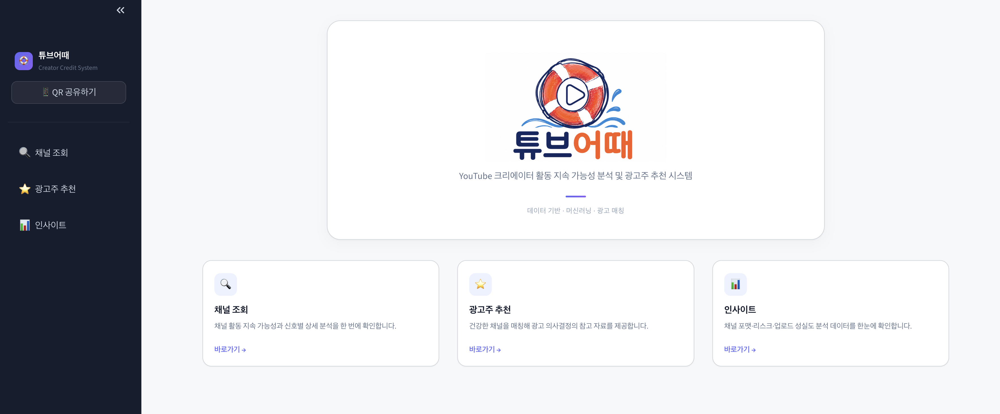
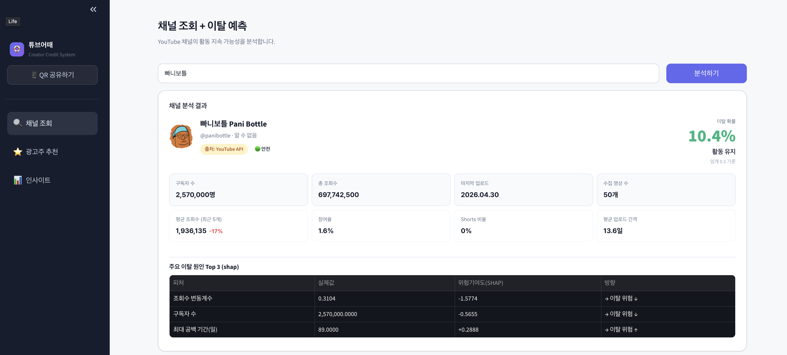

# 🛟 튜브어때 (TubeEottae)
### YouTube 크리에이터 분석을 통한 광고효율 및 지속가능성 추천 시스템

<div align="center">
  
  <p>"활동 중단(침몰)하지 않고 안정적으로 물에 떠 있을(지속 가능) 크리에이터를 찾아준다"</p>
</div>

### ✦ 프로젝트 기간
> 2026.05.15(목) ~ 2026.05.22(금) **(8일)**

### ✦ 서비스 체험
> **[🔗 튜브어때 바로가기](http://arc12.hopto.org:18080/)** _(~05/22까지)_

---


## 0. 팀 소개 · 너놀자

> "같이 놀듯이, 데이터로 답을 찾는 5인 팀"

| 이름 | 역할 |
|---|---|
| **강성준** | 데이터 수집 · Feature Engineering · ML 모델링 |
| **김도훈** | 데이터 수집 · Feature Engineering · ML 모델링 |
| **천성배** | 데이터 수집 · EDA · 데이터 분석 |
| **서해연** | 데이터 수집 · ERD · 딥러닝 · 백엔드 · 발표 |
| **정주애** | PM · 데이터 수집 · 프론트(Streamlit) · PPT |

---

## 1. 프로젝트 개요

### 대상 사용자

| 대상 | 활용 목적 |
|---|---|
| **광고주** | 최적 채널 선정 |
| **광고 에이전시** | ROI 기반 캠페인 |
| **MCN** | 크리에이터 관리 |

### 배경

1. **진성 인게이지먼트(실질 참여율)** 가 광고 단가의 핵심 지표로 부상 — '숫자 거품' 시대 종료
2. 광고 구간 이탈 방지의 핵심 = 크리에이터와 시청자 간의 **심리적 유대감**
3. 구독자 10~100만 **'허리 계층'** 채널의 성장 정체 및 슬럼프 해결 필요

### 문제 정의

- **광고주**: 매크로 댓글·친목질 등 전환력 낮은 채널을 걸러낼 **정량적 지표 부족**
- **에이전시/MCN**: 채널 몰락·파편화를 사전 감지 불가 — 조회수·시청시간 중심의 **사후적 지표 한계**

### 결과물

| | 내용 |
|---|---|
| **[광고주용]** | 최적 협업 대상 추천 매트릭스 |
| **[MCN용]** | 유튜버 이탈 위험도 예측 스코어 |

---

## 2. 기대 효과 & 한계점

### 기대 효과

| 대상 | 내용 |
|---|---|
| **광고주** | 진성 채널 선별을 통한 마케팅 **ROI 극대화** 및 광고 단가 최적화 |
| **에이전시/MCN** | 데이터 기반의 선제적 **리스크 알람** 및 장기적 수익 모델 확보 |

### 한계점 & 보완 과제

| 항목 | 내용 |
|---|---|
| **데이터 신뢰성** | 댓글 샘플링(최신 100개) 기반으로 편향성 발생 가능 |
| **포맷 차이** | 숏폼(휘발성)과 롱폼(깊이) 간 성격 차이로 인한 해석 왜곡 |
| **정성적 맥락** | 악플(부정 인게이지먼트) 구분을 위한 감성 분석 필터링 필요 |

---

## 3. WBS · 작업 일정

| 날짜 | 작업 |
|---|---|
| **5/15 (목)** | 주제 선정 & 배경 조사 |
| **5/16~17 (토·일)** | 데이터 수집 |
| **5/18 (월)** | 데이터 합치기 + 전처리 |
| **5/18~19 (월·화)** | 데이터 분석 EDA + Feature Engineering |
| **5/20~21 (수·목)** | 머신러닝 & 딥러닝 |
| **5/21 (목)** | 프론트 + 백엔드 |
| **5/22 (금)** | 발표 정리 & 시연 |

---

## 4. 데이터 소스

| 항목 | 내용 |
|---|---|
| **원천 데이터** | 국내 채널 9,427개 수집 |
| **학습 데이터** | 최종 3,331개 채널 · 영상 시계열 166,450건 |
| **댓글 감성** | 채널당 최신 10개 영상 댓글 100개 · KcELECTRA 긍부정 분석 |
| **클래스 비율** | 정상 채널 79.2% / 이탈 채널 20.8% (4:1 불균형) |

---

## 5. 프로젝트 설계

### 📂 디렉토리 구조

```
📦 SKN30-2nd-1Team/
├── app/                    # Streamlit 대시보드
│   ├── pages/              # 멀티 페이지 (대시보드·채널조회·인사이트·추천)
│   ├── components.py       # 공통 UI 컴포넌트
│   ├── styles.py           # 테마 및 CSS
│   └── data_loader.py      # 데이터 로더
├── data/                   # 데이터
├── notebooks/
│   ├── 01_data_collection/ # API 수집 및 전처리
│   └── 02_modeling/        # 모델 개발 노트북
├── docs/                   # PRD · 모델링 명세 · ERD
├── pyproject.toml
└── uv.lock
```

---

## 6. AI/ML 모델링

### 이탈(Churn) 정의
- Anchor 시점 기준 **최근 180일간 업로드가 없는 채널**을 `is_churned = 1`로 정의

### 파이프라인 비교

| | Pipeline A (기준) | Pipeline B (최종 채택) |
|---|---|---|
| **분할** | Train 80% / Test 20% | Train 60% / Valid 20% / Test 20% |
| **튜닝 지표** | ROC-AUC | F2-Score |
| **앙상블** | RF + GB + LGBM | XGBoost + LGBM + LR |
| **임계값** | 0.50 (고정) | 0.385 (최적화) |

### 최종 성능 비교

| 지표 | Pipeline A | Pipeline B |
|---|:---:|:---:|
| Test Accuracy | **0.8096** | 0.6522 |
| Test Recall (Churn) | 0.3200 | **0.8633** |
| F2-Score | 0.3515 | **0.6749** |
| Test ROC-AUC | **0.7962** | 0.7949 |

> Pipeline B는 Recall을 32% → **86.33%** 로 높여 이탈 채널 조기 탐지에 특화

### 주요 SHAP 피처

> Pipeline A (RandomForest) 기준 전역 피처 중요도

| 순위 | 피처 | 의미 |
|---|---|---|
| 1 | `subscriber_count` | 팬덤 기초 체력 — 낮을수록 이탈 위험 ↑ |
| 2 | `regularity_score` | 업로드 규칙성 — 낮을수록 이탈 위험 ↑ |
| 3 | `collected_video_count` | 수집된 영상 수 — 적을수록 이탈 위험 ↑ |
| 4 | `hiatus_count_30d` | 최근 장기 공백 횟수 — 많을수록 이탈 위험 ↑ |

---

## 7. UI / UX 대시보드

**Streamlit** 기반 멀티 페이지 대시보드

| 페이지 | 기능 |
|---|---|
| 1. 채널 조회 | 채널 ID 검색 → 이탈 점수·SHAP 원인 분석 |
| 2. 인사이트 | 카테고리별 이탈 위험 트렌드 |
| 3. 광고주 추천 | 장기 안정형 vs 단기 성장형 필터링 |

**리스크 등급**: 🟢 Grade A (안전) · 🟡 Grade B/C (경고) · 🔴 Grade D/F (고위험)

<div align="center">
  
  <p><b>메인 대시보드</b></p>
</div>

<div align="center">
  
  <p><b>채널 조회 — 이탈 점수 & SHAP 분석</b></p>
</div>

<div align="center">
  
  <p><b>광고주 추천 — 안정형 vs 성장형 필터링</b></p>
</div>

---

## 8. 팀원 소감 및 회고

- **강성준**
  > "실제 유튜버를 대상으로 서비스를 만드니 현실감이 느껴져서 좋았습니다. 데이터 분석을 위해 EDA 과정이 정말 중요하다는 것을 깨달았습니다. 모델 성능을 높이기 위해 여러 시행착오를 거치는 일이 저의 실력을 더욱 향상 시켰습니다. 같이 노력한 팀원들에게 감사합니다."

- **김도훈**
  > "모두가 ML DL 처음이어서 겪었던 정신 붕괴에 만들어진 수많은 데이터를 뒤집는 과정이 힘든 과정이었지만 이 또한 겪어야할 과정이었다. 주어진 시간 내에서 무한히 커지기만 하는 아이디에이션이 아닌 보수적으로 운영하면서 수정해나가는 시퀀스를 1차 프로젝트에 겪어서 정말 다행이라고 생각한다. 힘 써준 팀장 및 팀원에게 감사한다."

- **천성배**
  > "어느새 시간이 흘러 순식간에  2차 프로젝트라는 기간이 다가왔습니다. 이전 1차 프로젝트에서는 크롤링을 주로 다뤘는데, 이번 프로젝트에서는 EDA를 통해 광고주에서 얻을 수 있는 인사이트 들을 확인 할 수 있어 좋았습니다. 그리고 무엇보다 팀원들의 배려와 도움에 정말 감사 드립니다."

- **서해연**
  > "제한된 시간 안에서 다들 최선을 다해주셧다고 생각합니다. 모두들 고생 많으셨습니다."

- **정주애**
  > ""
