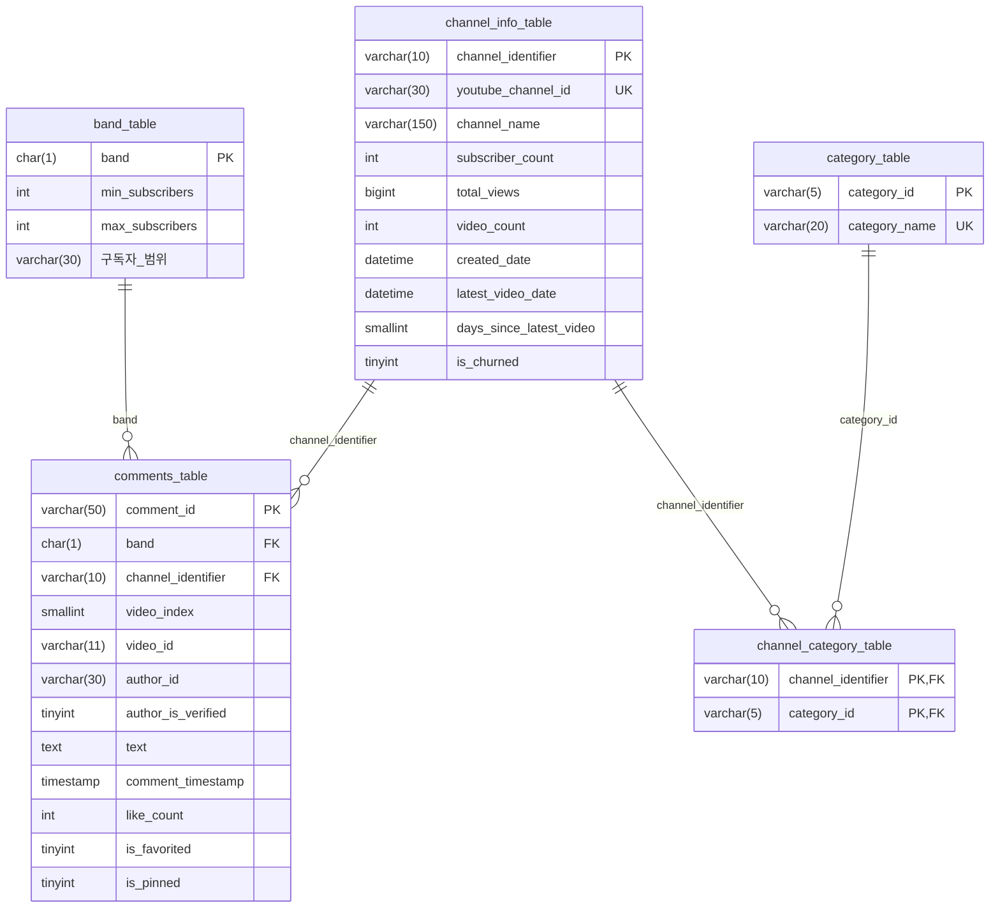

# MySQL DB ERD (`youtube_model_db`)

모델링/분석용 MySQL 데이터베이스(`youtube_model_db`)의 테이블 구조 및 관계 정의서.
원천 CSV 스키마는 [schema.md](schema.md) 참조.

---

## 1. ERD 다이어그램

---

## 2. 테이블 정의

### 2.1 `band_table` — 구독자 밴드 마스터

채널을 구독자 수 구간으로 묶어주는 마스터 테이블.

| 컬럼 | 타입 | 제약 | 설명 |
|---|---|---|---|
| `band` | `char(1)` | PK | 밴드 식별자 (예: `A`, `B`, ...) |
| `min_subscribers` | `int` | NOT NULL | 구간 최소 구독자 수 |
| `max_subscribers` | `int` | NOT NULL | 구간 최대 구독자 수 |
| `구독자 범위` | `varchar(30)` | NOT NULL | 사람이 읽기 위한 라벨 (예: `10만~50만`) |

---

### 2.2 `category_table` — 카테고리 마스터

YouTube 채널의 카테고리 분류 마스터.

| 컬럼 | 타입 | 제약 | 설명 |
|---|---|---|---|
| `category_id` | `varchar(5)` | PK | 카테고리 식별자 |
| `category_name` | `varchar(20)` | UNIQUE, NOT NULL | 카테고리명 (예: `뉴스/정치/사회`) |

---

### 2.3 `channel_info_table` — 채널 정보

수집된 채널의 정적/통계 정보 및 **이탈 라벨**.

| 컬럼 | 타입 | 제약 | 설명 |
|---|---|---|---|
| `channel_identifier` | `varchar(10)` | PK | 내부 채널 식별자 (단축 ID) |
| `youtube_channel_id` | `varchar(30)` | UNIQUE, NOT NULL | YouTube 원본 채널 ID (`UC…`) |
| `channel_name` | `varchar(150)` | NOT NULL | 채널명 |
| `subscriber_count` | `int` | NOT NULL | 구독자 수 |
| `total_views` | `bigint` | NOT NULL | 누적 조회수 |
| `video_count` | `int` | NOT NULL | 업로드 영상 수 |
| `created_date` | `datetime` | NOT NULL | 채널 개설일 |
| `latest_video_date` | `datetime` | NULL 가능 | 가장 최근 영상 업로드 일시 |
| `days_since_latest_video` | `smallint` | NULL 가능 | 최근 영상 이후 경과일 |
| `is_churned` | `tinyint` | NOT NULL, DEFAULT 0 | **타겟 변수** — 이탈 여부 (0/1) |

---

### 2.4 `channel_category_table` — 채널-카테고리 매핑 (N:M)

채널과 카테고리의 다대다 관계를 풀어주는 매핑 테이블.

| 컬럼 | 타입 | 제약 | 설명 |
|---|---|---|---|
| `channel_identifier` | `varchar(10)` | PK, FK → `channel_info_table.channel_identifier` | 채널 식별자 |
| `category_id` | `varchar(5)` | PK, FK → `category_table.category_id` | 카테고리 식별자 |

- 복합 PK: (`channel_identifier`, `category_id`)
- 인덱스: `fk_cc_category_table` (`category_id`)

---

### 2.5 `comments_table` — 댓글

채널별 영상 댓글 수집 데이터.

| 컬럼 | 타입 | 제약 | 설명 |
|---|---|---|---|
| `comment_id` | `varchar(50)` | PK | YouTube 댓글 ID |
| `band` | `char(1)` | FK → `band_table.band`, NOT NULL | 구독자 밴드 (수집 시점 스냅샷) |
| `channel_identifier` | `varchar(10)` | FK → `channel_info_table.channel_identifier`, NOT NULL | 채널 식별자 |
| `video_index` | `smallint` | NOT NULL | 채널 내 영상 순번 |
| `video_id` | `varchar(11)` | NOT NULL | YouTube 영상 ID |
| `author_id` | `varchar(30)` | NOT NULL | 댓글 작성자 ID |
| `author_is_verified` | `tinyint` | NOT NULL, DEFAULT 0 | 작성자 인증 여부 |
| `text` | `text` | NULL 가능 | 댓글 본문 |
| `comment_timestamp` | `timestamp` | NOT NULL | 댓글 작성 시각 |
| `like_count` | `int` | NOT NULL, DEFAULT 0 | 좋아요 수 |
| `is_favorited` | `tinyint` | NOT NULL, DEFAULT 0 | 채널 운영자가 좋아요한 댓글 여부 |
| `is_pinned` | `tinyint` | NOT NULL, DEFAULT 0 | 고정 댓글 여부 |

**인덱스**
- `idx_comments_video_id` (`video_id`)
- `idx_comments_channel_identifier` (`channel_identifier`)
- `idx_comments_band` (`band`)

---

## 3. 관계 요약

| From | To | 관계 | 키 |
|---|---|---|---|
| `comments_table` | `channel_info_table` | N:1 | `channel_identifier` |
| `comments_table` | `band_table` | N:1 | `band` |
| `channel_category_table` | `channel_info_table` | N:1 | `channel_identifier` |
| `channel_category_table` | `category_table` | N:1 | `category_id` |
| `channel_info_table` ↔ `category_table` | (매핑 테이블 경유) | N:M | `channel_category_table` |

---

## 4. 공통 사양

- **엔진**: `InnoDB`
- **문자셋 / Collation**: `utf8mb4` / `utf8mb4_unicode_ci`
- **명명 규칙**
  - 테이블: `<entity>_table`
  - FK 제약: `fk_<table_prefix>_<ref_table>` (예: `fk_comments_channel`)
  - 인덱스: `idx_<table>_<column>`, 유니크: `uq_<column>`
