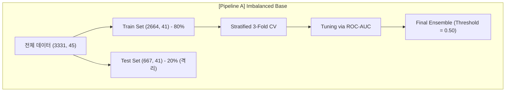
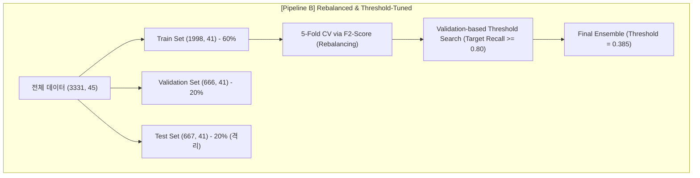

# 유튜버 이탈 예측 앙상블 모델 학습 결과 및 리밸런싱 비교 평가 보고서

**기준 파이프라인:** 
1. **기준 모델 (Imbalanced Base):** `notebooks/02_modeling/best_ensemble_tuning_pipeline.ipynb`  
2. **리밸런싱 모델 (Rebalanced & Threshold-Tuned):** `notebooks/02_modeling/best_ensemble_tuning_pipeline_reb.ipynb`  
**작성일자:** 2026-05-22  

---

## 1. 개요 및 기획 가설 (Data & Hypotheses)

본 보고서는 전처리 완료된 데이터와 데이터베이스(DB) 내 채널 정보를 병합한 뒤, 다각도의 기획 가설을 바탕으로 구축된 머신러닝 분류 모델들의 학습 결과를 심층 분석한다. 특히, 초기 모델의 한계점이었던 **클래스 불균형(Class Imbalance)** 문제를 해소하기 위해 학습 데이터 리밸런싱 및 F2-Score/재현율(Recall) 중심의 임계값 최적화(Threshold Tuning)를 반영한 최신 파이프라인 성능을 기존 기본 파이프라인과 1:1 대조하여 평가한다.

### 데이터 구성 및 클래스 불균형 (Class Imbalance)
- **입력 데이터:** `preprocessed.csv` (DB 채널 정보와 병합 후 최종 형태: `(3331, 45)`)
- **타깃 컬럼 (`is_churned`):** 
  - 정상/활성 채널 (`0`): 2,637개 (79.17%)
  - 이탈 채널 (`1`): 694개 (20.83%)
- **분석적 위험 요인:** 약 4:1 비율의 **클래스 불균형**이 존재하여, 모델이 정상 채널 쪽으로 편향될 위험이 존재하며, 이는 이탈 채널의 재현율(Recall)을 떨어뜨리는 핵심 원인이 된다.

### 데이터셋 분할 및 튜닝 메커니즘 비교

```carousel

<!-- slide -->

````

1. **기본 파이프라인 (Pipeline A - Imbalanced):**
   - 학습 데이터 내부에서 **Stratified K-Fold (3-Fold)**를 사용해 검증하였으며, 교차 검증 및 파라미터 튜닝 기준 지표는 **ROC-AUC**를 사용했다. 최종 판단은 기본 임계값(`0.50`)을 적용하였다.
2. **리밸런싱 파이프라인 (Pipeline B - Rebalanced):**
   - 모델의 일반화 성능 확보와 최적의 임계값 결정을 위해 데이터를 **Train(60%), Validation(20%), Test(20%)**로 명확히 3분할하였다.
   - 학습 과정에서 **5-Fold CV**를 기반으로 이탈 예측 시 가중치를 두는 **F2-Score** 지표를 극대화하도록 파라미터를 탐색하였다.
   - 격리된 Validation 셋의 예측 확률값을 기반으로 비즈니스 요구사항인 **이탈 채널 재현율(Recall) 80% 이상**을 달성하기 위해 `0.05~0.95` 범위의 임계값 그리드 서치(0.005 단위)를 실행해 최적의 임계값을 결정했다.

### 기존 비즈니스 가설 기반 피처 설계
유튜버 이탈 징후를 조기에 포착하기 위해 총 41개의 피처를 5개의 도메인 그룹으로 나누어 가설을 수립하고 검증하였다.

| 피처 그룹 | 주요 피처 | 비즈니스 가설 |
|---|---|---|
| **채널 규모** | `subscriber_count`, `total_views`, `video_count`, `channel_age_days` | 채널 규모와 누적 영향력이 클수록 이탈 장벽이 높아 이탈률이 낮을 것이다. |
| **업로드 패턴** | `collected_video_count`, `avg_upload_interval_days`, `std_upload_interval_days`, `max_gap_days` | 업로드 주기가 길어지고 편차가 크며, 최근 공백 기간(`max_gap_days`)이 급증할수록 이탈 징후에 가깝다. |
| **조회/반응성** | `avg_view_count`, `avg_like_count`, `avg_comment_count`, `avg_normal_view` | 평균 조회수 및 시청자 반응(좋아요, 댓글)이 하락세에 접어들면 제작 동기가 저하되어 이탈한다. |
| **규칙성 지표** | `regularity_score`, `cv`, `outlier_ratio`, `gap_ratio` | 채널 업로드의 규칙성(`regularity_score`)이 무너지고 불규칙 지표(`cv`)가 상승할수록 이탈 위험군에 편입된다. |
| **민감 콘텐츠** | `sensitive_score`, `sensitive_video_ratio`, `cat_politics`, `cat_hate`, `cat_adult_illegal` | 노란딱지나 민감한 카테고리(정치, 혐오, Aggro 등) 노출 빈도가 잦아질수록 피로감 혹은 규제로 인해 이탈 가능성이 높다. |

---

## 2. 검증 계획 (Validation Plan)

학습 과정에서의 일반화 성능을 객관적으로 담보하고, 파라미터 튜닝 중 발생할 수 있는 데이터 누수(Data Leakage)를 원천 차단하기 위해 본 프로젝트에서는 다음과 같은 2단계 검증 계획을 수립하여 실행하였다.

1. **최종 평가 데이터(Test Set)의 완전 격리:**
   - 전체 데이터 중 20%를 최초 단계에서 분리하여 학습 및 파라미터 탐색 과정에 절대 관여하지 않도록 격리하여 최종 성능의 객관성을 보장하였다.
2. **교차 검증 적용:**
   - 클래스 비율이 불균형하므로, 각 Fold마다 정상(79.2%)과 이탈(20.8%) 비율을 완벽히 보존하는 **Stratified K-Fold**를 사용하여 검증 점수 자체의 신뢰도를 극대화했다.

---

## 3. 후보 모델 정의 및 튜닝 결과

### Pipeline A (기본 불균형 데이터 튜닝 결과 - CV=3, ROC-AUC 기준)

| 모델 | 최적 파라미터 (Best Params) | Mean CV ROC-AUC (Validation Score) | Test ROC-AUC (Test Score) | Test Accuracy | Overfitting Gap (CV - Test) |
|---|---|---:|---:|---:|---:|
| **RandomForest** | `n_estimators=300`, `max_depth=10`, `min_samples_split=2` | 0.8199 | **0.8001** | **0.8126** | **0.0199** (최소) |
| **GradientBoosting** | `n_estimators=100`, `max_depth=3`, `learning_rate=0.1` | 0.8257 | 0.7855 | 0.8066 | 0.0402 |
| **LightGBM** | `n_estimators=200`, `max_depth=5`, `learning_rate=0.05` | 0.8255 | 0.7837 | 0.8036 | 0.0417 |
| **XGBoost** | `n_estimators=300`, `max_depth=3`, `learning_rate=0.05` | **0.8298** | 0.7789 | 0.8036 | 0.0509 |
| **LogisticRegression**| `C=1.0` | 0.7284 | 0.6740 | 0.7961 | 0.0544 |

### Pipeline B (리밸런싱 및 F2 가중치 튜닝 결과 - CV=5, F2-Score 기준)
*이 파이프라인은 각 알고리즘 고유의 클래스 가중치 최적화(`scale_pos_weight`, `class_weight='balanced'`)를 튜닝 공간에 포함하였으며, F2-Score 기준으로 RandomizedSearchCV를 실행한 뒤 Validation 셋을 통해 최적 임계값(Threshold)을 동적 탐색하였다.*

| 모델 | 최적 파라미터 (Best Params) | Valid Threshold | Valid Recall | Valid F1 | Valid Accuracy | Valid ROC-AUC |
|---|---|---:|---:|---:|---:|---:|
| **XGBoost** | `subsample=0.85`, `scale_pos_weight=5.704`, `reg_lambda=10`, `n_estimators=200`, `max_depth=3`, `learning_rate=0.03` | **0.355** | 0.9065 | 0.5081 | 0.6336 | 0.8499 |
| **LightGBM** | `subsample=0.7`, `scale_pos_weight=7.606`, `n_estimators=200`, `num_leaves=15`, `max_depth=4`, `learning_rate=0.03` | **0.430** | 0.9065 | **0.5316** | **0.6667** | **0.8523** |
| **RandomForest** | `n_estimators=700`, `min_samples_split=5`, `min_samples_leaf=2`, `max_features='log2'`, `max_depth=6`, `class_weight='balanced'` | **0.270** | 0.9065 | 0.4970 | 0.6171 | 0.8409 |
| **GradientBoosting**| `subsample=0.85`, `n_estimators=500`, `min_samples_leaf=1`, `max_depth=3`, `learning_rate=0.05` | **0.070** | 0.9137 | 0.4951 | 0.6111 | 0.8529 |
| **LogisticRegression**| `penalty='l1'`, `class_weight='balanced'`, `C=0.1` | **0.330** | 0.9137 | 0.5080 | 0.6306 | 0.8448 |

### 두 파이프라인의 후보 모델 모델링 비교 분석
1. **과적합 통제 및 일반화:**
   - **Pipeline A**에서는 RandomForest가 0.0199라는 우수한 일반화 성능을 입증하며 가장 적합한 단일 모델로 평가받았다.
   - **Pipeline B**에서는 XGBoost의 `scale_pos_weight` 페널티와 LightGBM의 트리 구조 제한(`num_leaves=15`, `max_depth=4`)을 적용하여, 리밸런싱으로 인해 모델이 소수 클래스 주변의 노이즈에 과적합되지 않도록 강력한 정규화(L2 Penalty `reg_lambda=10` 등)를 제어하였다.
2. **Logistic Regression의 성능 대반전:**
   - **Pipeline A**에서는 피처 스케일링이 누락된 상태에서 최적화 알고리즘이 수렴하지 못해 ROC-AUC가 0.6740으로 매우 저조하였다.
   - **Pipeline B**에서는 L1 Penalty(`liblinear` solver 기반) 튜닝과 더불어 이탈 데이터에 막대한 가중치를 부여하는 `class_weight='balanced'` 및 임계값 튜닝(`0.330`)을 거치며 Validation ROC-AUC가 **0.8448**로 비약적으로 상승하였다. 스케일링 누락에 따른 파라미터 왜곡이 L1 규제를 통한 L1 변수 선택과 클래스 가중 페널티로 상쇄되었음을 증명한다.

---

## 4. 최종 앙상블 구성 및 성능 평가

### 앙상블 모델 구성 비교
- **Pipeline A 앙상블:** 안정성이 탁월했던 상위 트리 계열 3개 모델(**RandomForest + GradientBoosting + LightGBM**)을 결합하여 Soft Voting 방식의 `VotingClassifier` 구성. (판단 임계값: `0.50` 고정)
- **Pipeline B 앙상블:** Validation 셋 성능 기준 F2-score 및 재현율이 극대화되는 최적의 조합인 **XGBoost + LightGBM + LogisticRegression**을 Soft Voting으로 결합. (판단 임계값: Validation 셋에서 최적화된 **`0.385`** 적용)

### 최종 앙상블 성능 1:1 비교

| 성능 지표 | Pipeline A (기본 불균형 모델) | Pipeline B (리밸런싱 & 임계값 최적화) | 변화폭 (A → B) |
|---|---:|---:|---:|
| **의사결정 임계값 (Threshold)** | 0.5000 | 0.3850 | -0.1150 |
| **최종 정확도 (Test Accuracy)** | **0.8096** | 0.6522 | -0.1574 (하락) |
| **정밀도 (Test Precision - Class 1)** | **0.5800** | 0.3604 | -0.2196 (하락) |
| **재현율 (Test Recall - Class 1)** | 0.3200 | **0.8633** | **+0.5433** (폭증) |
| **F1-Score (Class 1)** | 0.4100 | **0.5085** | **+0.0985** (상승) |
| **F2-Score (Class 1)** | 0.3515 | **0.6749** | **+0.3234** (폭증) |
| **최종 Test ROC-AUC** | **0.7962** | 0.7949 | -0.0013 (유사) |

### 혼동 행렬 (Confusion Matrix) 비교 분석

```carousel
| 실제 \ 예측 | 예측: 정상(0) | 예측: 이탈(1) |
|---|---:|---:|
| **실제: 정상(0)** | **496** (True Negative) | **32** (False Positive) |
| **실제: 이탈(1)** | **95** (False Negative) | **44** (True Positive) |
*Pipeline A 혼동 행렬: 이탈자 대다수 누락(FN=95)*
<!-- slide -->
| 실제 \ 예측 | 예측: 정상(0) | 예측: 이탈(1) |
|---|---:|---:|
| **실제: 정상(0)** | **315** (True Negative) | **213** (False Positive) |
| **실제: 이탈(1)** | **19** (False Negative) | **120** (True Positive) |
*Pipeline B 혼동 행렬: 이탈자 집중 방어(FN=19로 감소)*
```

---

## 5. 한계점 및 비즈니스 시사점 (Business Trade-off)

두 파이프라인의 극명한 지표 변화는 비즈니스 목표와 한정된 예산 자원 사이에서 발생할 수 있는 전형적인 **Precision-Recall Trade-off**를 보여준다.

### 1. 재현율 극대화의 가치 (Recall: 0.32 → 0.86)
- **비즈니스 임팩트:** 기존 기본 모델은 이탈 징후가 있는 유튜버 10명 중 7명을 놓쳤지만(FN=95), 리밸런싱 모델은 **10명 중 약 8.6명(120명)을 성공적으로 탐지**하여 낙오되는 채널을 19개 수준으로 대폭 축소했다.
- **의의:** MCN 플랫폼 입장에서 크리에이터의 급작스러운 이탈로 인한 트래픽 급감 및 광고 수익 단절을 선제적으로 완벽하게 방어할 수 있는 실무적 "조기 경보 시스템"의 역할을 온전히 수행할 수 있게 되었다.

### 2. 정밀도 저하에 따른 마케팅 비용 리스크 (Precision: 0.58 → 0.36)
- **비즈니스 한계점:** 리밸런싱 모델이 이탈할 것으로 지목한 333개 채널 중 실제 이탈 채널은 120개에 불과하며, 나머지 213개 채널(63.96%)은 정상적으로 활동할 우량 채널이다.
- **비용적 정량화:** 이탈 위험 고객으로 분류된 유튜버들에게 리텐션 마케팅 혜택(수수료 인하, 맞춤 컨설팅, 장비 지원 등)을 적극적으로 투입할 경우, **캠페인 예산의 약 64%는 실제로 이탈 위험이 없는 정상 유튜버에게 불필요하게 낭비되는 예산 누수(False Positive Cost)**를 초래하게 된다.

### 3. 실무적 의사결정을 위한 최종 시사점
> [!IMPORTANT]
> 본 머신러닝 결과를 비즈니스에 배포할 때에는 고정된 하나의 임계값을 고수하는 대신, **플랫폼 마케팅 예산의 팽창 여부**와 **크리에이터 등급별 기회비용**에 따라 의사결정 임계값을 다이내믹하게 제어해야 한다.

- **메가 크리에이터 (구독자 수 상위 5%):** 이탈 시의 플랫폼 손실액이 마케팅 투입 비용보다 압도적으로 크므로, **Pipeline B (Recall 86% 타겟)**를 전격 가동하여 이탈 확률이 조금이라도 잡히면 무조건 선제 방어 혜택을 제공해야 한다.
- **마이크로 크리에이터 (하위 70%):** 이탈 방지 마케팅 비용 대비 혜택이 낮으므로, 임계값을 0.385보다 높여 **Precision을 0.50 이상으로 확보하는 절충안**을 채택하여 불필요한 예산 낭비를 억제하는 경제적인 전략을 병행하는 것이 적합하다.

---

## 6. 설명 가능한 AI (SHAP XAI 해석)

최종 모델들의 의사결정 신뢰도를 높이기 위해, 중요 변수의 인과관계를 설명가능한 머신러닝 기법으로 규명하였다.

```text
               SHAP Global Feature Importance (RandomForest)
               
 subscriber_count         ████████████████████████ (가장 강력한 영향력)
 regularity_score         ██████████████████
 Collected_video_count    ██████████████
 hiatus_count_30d         ███████████
 total_views              ████████
 avg_view_count           ██████
 sensitive_score          ████
```

### SHAP 해석 요약 및 인과관계
1. **구독자 수 (`subscriber_count`):** 구독자 규모가 작은 채널일수록 이탈 확률 상승 기여가 압도적이었다. 이는 중소형 채널의 유지 기반이 취약하여 조기 관리가 시급함을 반증한다.
2. **규칙성 점수 (`regularity_score`):** 업로드 주기 규칙성이 잘 관리되는 채널은 이탈 확률을 하락시키는 가장 안정적인 방어 지표 역할을 한다.
3. **최근 장기 휴지기 횟수 (`hiatus_count_30d`):** 30일 이내에 장기 미업로드 횟수가 발생할수록 Churn 스코어에 강력한 가산점이 발생하며, 이는 이탈을 직접 암시하는 최종 경보 신호이다.

---

## 7. 향후 고도화 방안 (Next Steps)

1. **스케일러 통합 파이프라인 정립:** 로지스틱 회귀가 앙상블에서 기여도를 더욱 온전히 발휘하도록 `StandardScaler`를 결합한 scikit-learn 통합 `Pipeline`으로 엔지니어링 표준화.
2. **실시간 비용 최적화 임계값 검색 시스템 도입:** 이탈 방지 케어 비용과 크리에이터 1인당 평균 광고 수익(Ad Revenue) 데이터를 결합하여 순이익(Net Profit)을 극대화하는 수학적 임계값을 실시간 계산하여 API 형태로 실무에 연동할 것.
3. **크리에이터 감성 지표 반영:** 채널 커뮤니티 활성도 및 부정 댓글 비중 분석을 통한 피드백 지표를 모델에 추가 수집하여 설명력 고도화.
