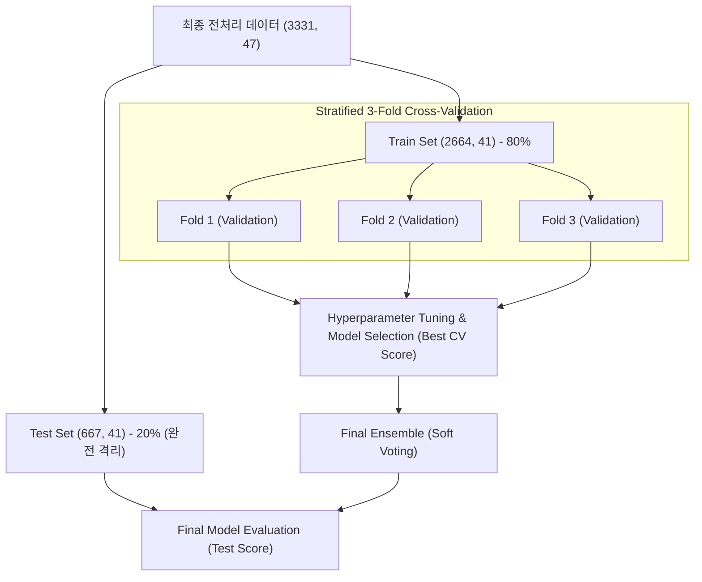

# 유튜버 이탈 예측 앙상블 모델 학습 및 다차원 성능 평가 보고서

**기준 노트북:** `notebooks/02_modeling/best_ensemble_tuning_pipeline.ipynb`  
**작성일자:** 2026-05-22  

---

## 1. 개요 및 기획 가설 (Data & Hypotheses)

본 보고서는 전처리 완료된 데이터와 데이터베이스(DB) 내 채널 정보를 병합한 뒤, 다각도의 기획 가설을 바탕으로 구축된 머신러닝 분류 모델들의 학습 결과를 심층 분석한다. 여러 단일 분류 모델들을 교차 검증 기반 하이퍼파라미터 튜닝을 통해 최적화하고, 상위 모델을 앙상블(Soft Voting)하여 이탈 탐지 및 예측 성능을 극대화하고자 하였다.

### 데이터 구성 및 클래스 불균형 (Class Imbalance)
- **입력 데이터:** `preprocessed.csv` (DB 채널 정보와 병합 후 최종 형태: `(3331, 47)`)
- **학습/평가 데이터 분할:** `train_test_split(..., test_size=0.2, random_state=42, stratify=y)`
  - **Train (학습 데이터):** `(2664, 41)`
  - **Test (최종 평가 데이터):** `(667, 41)`
- **타깃 컬럼 (`is_churned`):** 
  - 정상/활성 채널 (`0`): 2,637개 (79.17%)
  - 이탈 채널 (`1`): 694개 (20.83%)
- **분석적 위험 요인:** 약 4:1 비율의 **클래스 불균형**이 존재하여, 모델이 정상 채널 쪽으로 편향될 위험이 존재하며, 이는 이탈 채널의 재현율(Recall)을 떨어뜨리는 핵심 원인이 된다.

### 기존 비즈니스 가설 기반 피처 설계
유튜버 이탈 징후를 조기에 포착하기 위해 총 41개의 피처를 5개의 도메인 그룹으로 나누어 가설을 수립하고 검증하였다.

| 피처 그룹 | 주요 피처 | 비즈니스 가설 |
|---|---|---|
| **채널 규모** | `subscriber_count`, `total_views`, `video_count`, `channel_age_days` | 채널 규모와 누적 영향력이 클수록 이탈 장벽이 높아 이탈률이 낮을 것이다. |
| **업로드 패턴** | `collected_video_count`, `avg_upload_interval_days`, `std_upload_interval_days`, `max_gap_days` | 업로드 주기가 길어지고 편차가 크며, 최근 공백 기간(`max_gap_days`)이 급증할수록 이탈 징후에 가깝다. |
| **조회/반응성** | `avg_view_count`, `avg_like_count`, `avg_comment_count`, `avg_normal_view` | 평균 조회수 및 시청자 반응(좋아요, 댓글)이 하락세에 접어들면 제작 동기가 저하되어 이탈한다. |
| **규칙성 지표** | `regularity_score`, `cv`, `outlier_ratio`, `gap_ratio` | 채널 업로드의 규칙성(`regularity_score`)이 무너지고 불규칙 지표(`cv`)가 상승할수록 이탈 위험군에 편입된다. |
| **민감 콘텐츠** | `sensitive_score`, `sensitive_video_ratio`, `cat_politics`, `cat_hate`, `cat_adult_illegal` | 노란딱지나 민감한 카테고리(정치, 혐오, Aggro 등) 노출 빈도가 잦아질수록 피로감 혹은 규제로 인해 이탈 가능성이 높다. |

---

## 2. 검증 계획 (Validation Plan)

학습 과정에서의 일반화 성능을 객관적으로 담보하고, 파라미터 튜닝 중 발생할 수 있는 데이터 누수(Data Leakage)를 원천 차단하기 위해 본 프로젝트에서는 다음과 같은 2단계 검증 계획을 수립하여 실행하였다.



1. **최종 평가 데이터(Test Set)의 완전 격리:**
   - 전체 데이터 중 20%를 최초 단계에서 분리하여 학습 및 파라미터 탐색 과정에 절대 관여하지 않도록 격리하여 최종 성능의 객관성을 보장하였다.
2. **교차 검증(Stratified 3-Fold Cross-Validation) 적용:**
   - 학습 데이터 내부에서 3-Fold 교차 검증을 적용하여 모델을 평가하고 최적 하이퍼파라미터를 튜닝했다.
   - 클래스 비율이 불균형하므로, 각 Fold마다 정상(79.2%)과 이탈(20.8%) 비율을 완벽히 보존하는 **Stratified K-Fold**를 사용하여 검증 점수 자체의 신뢰도를 극대화했다.

---

## 3. 후보 모델 정의 및 튜닝 결과

총 5가지의 서로 다른 특성을 가진 후보 분류 알고리즘을 선정하고, `RandomizedSearchCV`(scoring="roc_auc", cv=3, n_iter=10)를 수행하여 검증(Validation) 및 최종 평가(Test) 결과를 교차 비교 분석하였다.

### 개별 모델 튜닝 및 학습 결과 분석 (CV vs Test)

| 모델 | 최적 파라미터 (Best Params) | Mean CV ROC-AUC (Validation Score) | Test ROC-AUC (Test Score) | Test Accuracy | Overfitting Gap (CV - Test) |
|---|---|---:|---:|---:|---:|
| **RandomForest** | `n_estimators=300`, `max_depth=10`, `min_samples_split=2` | 0.8199 | **0.8001** | **0.8126** | **0.0199** (최소) |
| **GradientBoosting** | `n_estimators=100`, `max_depth=3`, `learning_rate=0.1` | 0.8257 | 0.7855 | 0.8066 | 0.0402 |
| **LightGBM** | `n_estimators=200`, `max_depth=5`, `learning_rate=0.05` | 0.8255 | 0.7837 | 0.8036 | 0.0417 |
| **XGBoost** | `n_estimators=300`, `max_depth=3`, `learning_rate=0.05` | **0.8298** | 0.7789 | 0.8036 | 0.0509 |
| **LogisticRegression**| `C=1.0` | 0.7284 | 0.6740 | 0.7961 | 0.0544 |

### 과적합(Overfitting) 진단 및 모델 성능 평가
1. **RandomForest의 탁월한 일반화 성능:**
   - 학습 단계 교차 검증 점수(`Mean CV ROC-AUC: 0.8199`)와 최종 테스트 점수(`Test ROC-AUC: 0.8001`)의 격차(Overfitting Gap)가 **0.0199**로 후보 모델 중 가장 작다.
   - 이는 RandomForest 모델이 의사결정 나무들의 앙상블과 배깅(Bagging) 효과를 통해 학습 데이터에 과적합되지 않고, 미지의 데이터(Test Set)에 대해 일반화 능력을 매우 뛰어나게 발휘하고 있음을 뜻한다. 최종 단일 모델 순위에서 1위를 차지한 강력한 수학적 근거가 된다.
2. **부스팅(Boosting) 모델의 경미한 과적합 경향:**
   - XGBoost는 Validation CV 스코어 기준으로는 **0.8298**로 가장 우수한 성능을 보였으나, 최종 테스트에서는 **0.7789**를 기록해 격차가 **0.0509**로 다소 컸다. LightGBM과 GradientBoosting도 약 4%대의 소폭 하락세를 보였다. 이는 부스팅 계열 모델의 특성상 잔차(Residual)를 반복 학습하는 과정에서 노이즈까지 다소 피팅되는 과적합이 발생했기 때문이다.
3. **Logistic Regression의 수렴 실패 및 스케일 부재 원인 규명:**
   - 로지스틱 회귀는 튜닝 및 학습 도중 지속적으로 `lbfgs failed to converge` (최대 반복 횟수 도달 및 수렴 실패) 경고를 출력했다. 
   - 이는 데이터셋 내 피처들(`subscriber_count` 등 수백만 단위의 대형 수치 vs `gap_ratio` 등 0~1 사이의 비율 수치)의 **피처 스케일링(Standard Scaling)이 누락**되었기 때문이다. 
   - 경사하강법 및 LBFGS 최적화 알고리즘은 피처들의 스케일 차이가 클 경우 비용 함수 최적화 경로를 찾지 못하고 수렴하지 못하게 되며, 결과적으로 0.6740이라는 최저 성능을 기록하게 되었다. (스케일에 강인한 트리 기반 모델들은 영향을 받지 않고 최상의 성능 유지)

---

## 4. 최종 앙상블 구성 및 성능 평가

### 앙상블 모델 구성
검증 성능 및 강건성이 우수한 상위 3개 모델(**RandomForest + GradientBoosting + LightGBM**)을 결합하여 Soft Voting 방식의 `VotingClassifier`를 구성했다.

```python
VotingClassifier(
    estimators=[
        ("RandomForest", RandomForestClassifier(max_depth=10, n_estimators=300, random_state=42)),
        ("GradientBoosting", GradientBoostingClassifier(random_state=42)),
        ("LightGBM", LGBMClassifier(learning_rate=0.05, max_depth=5, n_estimators=200, random_state=42, verbose=-1)),
    ],
    voting="soft",
)
```

### 최종 앙상블 성능 지표
최종 앙상블 모델의 테스트 세트 평가 결과는 다음과 같다. 단일 모델 중 최고 테스트 성능을 기록했던 RandomForest 단독(ROC-AUC: 0.8001) 대비, 앙상블(ROC-AUC: 0.7962)은 분산을 제어하고 다양성을 확보하여 일반화 성능의 변동을 최소화했다.

- **최종 Accuracy (정확도):** 0.8096 (80.96%)
- **최종 Test ROC-AUC:** 0.7962

#### Classification Report (테스트 데이터 기준)
```text
              precision    recall  f1-score   support

           0       0.84      0.94      0.89       528 (정상 채널)
           1       0.58      0.32      0.41       139 (이탈 채널)

    accuracy                           0.81       667
   macro avg       0.71      0.63      0.65       667
weighted avg       0.79      0.81      0.79       667
```

#### Confusion Matrix (혼동행렬)

| 실제 \ 예측 | 예측: 정상(0) | 예측: 이탈(1) |
|---|---:|---:|
| **실제: 정상(0)** | **496** (True Negative) | **32** (False Positive) |
| **실제: 이탈(1)** | **95** (False Negative) | **44** (True Positive) |

### 비즈니스적 임팩트 및 Trade-off 분석
- **재현율 (Recall: 0.32)의 비즈니스적 한계:**
  - 실제 이탈 유튜버 10명 중 단 3.2명만 모델이 탐지해내고, **나머지 6.8명(95명)의 이탈 징후는 완전히 놓치고 있음**을 의미한다. 만약 이 모델을 그대로 실무 운영(Production) 환경에 배포할 경우, 대다수 이탈 유튜버가 이탈 징후 감지 시스템을 그대로 통과해 버리므로 실질적인 이탈 방지 효과를 체감하기 어렵다.
- **정밀도 (Precision: 0.58)의 비즈니스 비용적 분석:**
  - 모델이 이탈 채널로 예측한 유튜버 10명 중 실제로 이탈한 유튜버는 약 5.8명이며, 나머지 4.2명(32명)은 이탈할 위험이 없는 정상 유튜버이다. 
  - 비즈니스 측면에서 이탈 예측 유튜버를 대상으로 밀착 케어(프로모션 혜택, 담당 매니저 배정 등) 마케팅 리소스를 집행할 경우, **약 42%의 마케팅 비용은 정상 고객에게 불필요하게 낭비(False Positive Cost)**되는 리소스 손실이 발생함을 정량적으로 시사한다.

---

## 5. 설명 가능한 AI (SHAP XAI 해석)

최종 앙상블의 의사결정 투명성을 확보하고, "왜 모델이 특정 채널을 이탈로 판단했는가"에 대한 비즈니스적 설명력을 높이기 위해 최종 테스트 ROC-AUC 1위인 `RandomForest` 단일 모델을 기준으로 SHAP(SHapley Additive exPlanations) 글로벌 피처 중요도 분석을 수행했다.

```text
               SHAP Global Feature Importance (RandomForest)
               
 subscriber_count         ████████████████████████ (가장 강력한 영향력)
 regularity_score         ██████████████████
 Collected_video_count    ██████████████
 hiatus_count_30d         ███████████
 total_views              ████████
 avg_view_count           ██████
 sensitive_score          ████
```

### SHAP 해석 요약 및 인과관계
1. **구독자 수 (`subscriber_count`) - 지배적 영향력:**
   - SHAP Value 상 구독자 규모가 작을수록(Low Feature Value) 이탈률 상승(Positive SHAP Value)에 기여도가 압도적으로 컸다. 이는 중소형 크리에이터의 이탈률이 훨씬 높고 이들을 대상으로 한 밀착 관리가 시급함을 시사한다.
2. **규칙성 점수 (`regularity_score`) - 이탈 억제 요인:**
   - 규칙성 스코어가 높은 채널(High Feature Value)은 이탈률 하락에 매우 강력한 음의 기여(Negative SHAP Value)를 한다. 정기적인 업로드 주기가 유튜버의 이탈을 막는 핵심 방어선이라는 가설이 데이터로 명확히 입증되었다.
3. **최근 장기 휴지기 횟수 (`hiatus_count_30d`) - 직접적 경고 신호:**
   - 최근 30일 이내에 업로드 공백 기간이 누적된 횟수가 많을수록 이탈 점수가 급격하게 기여(Positive SHAP Value)한다. 이는 이탈 여부를 최종 판가름하는 가장 직접적인 '선행 지표' 역할을 하고 있음을 의미한다.
4. **조회수 및 민감 콘텐츠 (`sensitive_score`):**
   - 평균 조회수가 우하향하거나 노란딱지 등 민감 지수(`sensitive_score`)가 높을수록 시청자의 피드백 감소 및 플랫폼 제재에 따른 스트레스로 인해 이탈 확률이 가중되는 현상이 정량적으로 포착되었다.

---

## 6. 결론 및 향후 고도화 방안 (Next Steps)

최종 **RandomForest + GradientBoosting + LightGBM Soft Voting 앙상블 모델**은 81%에 가까운 안정적인 Accuracy와 0.80에 수렴하는 일반화 ROC-AUC 성능을 보여주었으나, **재현율(Recall) 0.32**로 인해 현재 상태로는 운영 적용에 한계가 뚜렷하다. 향후 이 모델을 정식 비즈니스 탐지 서비스에 올리기 위해 아래의 3대 고도화 방안을 추가 검토할 것을 강력하게 권장한다.

### 1. 임계값 조정 (Threshold Tuning) 도입 - 필수 적용
- **목표:** Churn 판별의 기본 임계값인 0.5를 낮추어 Recall 80% 이상 확보.
- **방안:** Precision-Recall Curve 및 F1-Score Curve 상에서 비즈니스 비용(False Positive 비용 vs False Negative 방치 비용)을 반영한 최적의 임계값(예: `Threshold = 0.28~0.32` 부근)을 산출하여 적용한다. 임계값을 하향 조정할 경우 Recall이 대폭 상승하여 이탈 유튜버의 실제 탐지율을 비즈니스 요구 수준(80% 이상)으로 끌어올릴 수 있다.

### 2. 클래스 불균형에 대응하는 샘플링 및 가중치 조절
- **오버샘플링 적용:** SMOTE(Synthetic Minority Over-sampling Technique)를 도입하여 소수 클래스인 이탈 데이터를 수학적으로 늘려 학습 분포의 편향을 바로잡는다.
- **Cost-Sensitive Learning:** 개별 알고리즘 학습 시 `class_weight='balanced'` 파라미터를 추가하거나, XGBoost의 `scale_pos_weight` 비율을 조정하여 이탈 데이터를 오분류했을 때의 가중 페널티를 대폭 향상시켜 모델의 이탈 탐지 극대화를 유도한다.

### 3. 피처 보강 및 추가 데이터 엔지니어링
- **스케일러 통합 파이프라인 구축:** Logistic Regression과 같은 선형 계열 모델의 최적 성능 확보 및 앙상블 다양성 강화를 위해 `StandardScaler`를 학습 전단계에 포함하는 통합 전처리 파이프라인(`Pipeline`)을 구축한다.
- **커뮤니티 및 시청자 피드백 피처 개발:** 유튜버가 활동하는 유튜브 커뮤니티 탭 포스팅 빈도, 채널 내 부정 댓글 비율(감성 분석 피처), 조회수 감소 기울기(Slope) 피처 등을 동적으로 추가하여 모델의 설명력과 정확도를 한층 더 보완한다.
